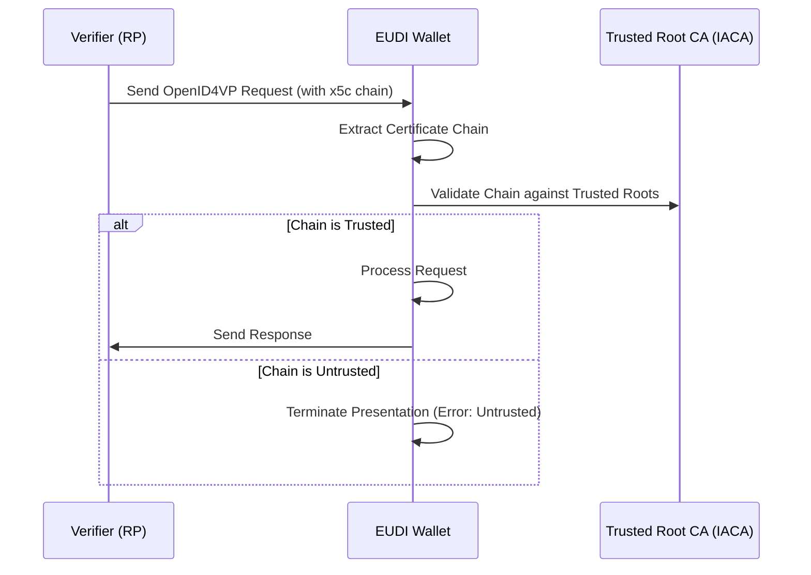
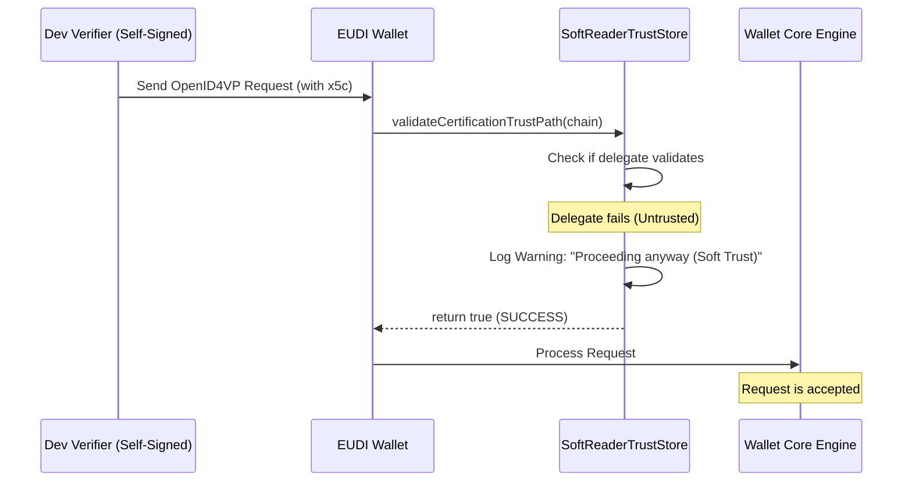

# Running the wallet with the ewQwe Credential Demo Web App

:warning: **IMPORTANT: FOR TESTING ONLY** :warning:
The modifications described in this document are strictly for development and testing purposes. They intentionally weaken the security of the application to allow interoperability with development environments that use self-signed certificates or untrusted CAs. **These changes MUST NOT be used in a production environment.**

---

## Setup and Demo Instructions

To test the HAIP wallet with a local development environment, follow these steps:

### 1. Create and Start the Emulator
You must use a rootable emulator image (Google APIs, non-Play Store) and start it with a writable system partition to allow host redirection.

*   Run the following script from the project root:
    ```bash
    ./start_ewqwe_eudi_emulator.sh
    ```
*   **What this script does:**
    1.  Automatically installs the correct Android system image if missing.
    2.  Creates a custom AVD named `EUDI_Dev_Device` using a **Pixel 6 Pro** profile.
    3.  Enables **hardware keyboard passthrough** so you can type using your computer.
    4.  Starts the emulator with the `-writable-system` flag.
    5.  **Important:** It maps the hostname `ewqwe.local` inside the emulator to your machine's actual local IP address. This allows the wallet to resolve local development servers.

### 2. Run the Application
*   Open the project in Android Studio.
*   Select the `app` module and the `EUDI_Dev_Device` emulator.
*   Click **Run** to deploy and start the EUDI Wallet App.

### 3. Initialize Documents
*   Follow the on-screen instructions to create a **PIN Code**.
*   Tap the **"+"** icon and select **"Add a Document from List"**.
*   Select **"mDL (MSO MDOC)"** and **"PID (MSO MDOC)"** under the list `https://euidw.dev`.
*   When prompted for the country, select **"Form EU"**.
*   Fill in the test form, submit it, and authorize the issuance.

### 4. Open the Relying Party Demo Webapp
*   Start your local **ewqwe demo webapp** (following the instructions in its own repository).
*   Open the **Chrome** browser on the Android Emulator.
*   Navigate to: `https://ewqwe.local:5174`, and proceed despite the certificate warnings; they are due to our using a self-signed certificate on the Demo Webapp.
*   The Demo webapp should appear.

### 5. Request HAIP Credentials
*   From the webapp, initiate a request for HAIP credentials for the documents you just created.
*   This action should trigger a deep link that opens the **EUDI HAIP wallet**. 
*   Because of our TLS bypasses, the wallet should be able to proceed and send the credentials to the demo webapp.


---

## Technical Overview of Modifications

In a production environment, the EUDI Wallet strictly validates the identity of the parties it communicates with. During development, these parties often use self-signed certificates. We have implemented "Soft Trust" bypasses to facilitate testing.

### 1. Untrusted TLS Certificates (Network Layer)
The `HttpClient` bypasses standard X509 certificate validation to allow connections to local development servers.
*   **File:** `network-logic/.../di/NetworkModule.kt`

### 2. Untrusted OpenID4VP Request Signers (Reader Trust)
A `SoftReaderTrustStore` bypasses the `x5c` chain validation against trusted IACAs and logs a warning instead.
*   **File:** `core-logic/.../util/SoftReaderTrustStore.kt`
*   **Integration:** `core-logic/.../di/LogicCoreModule.kt`

---

## How it works (Production vs. Testing)

### Production Flow (Strict Trust)


### Testing Flow (Soft Trust Bypass)

