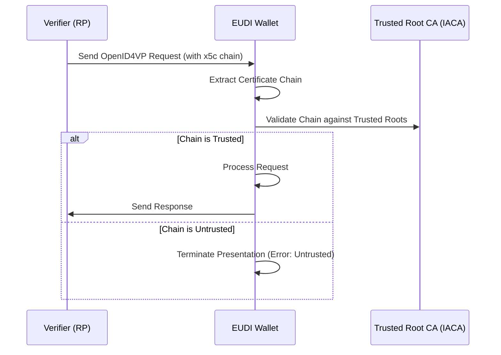
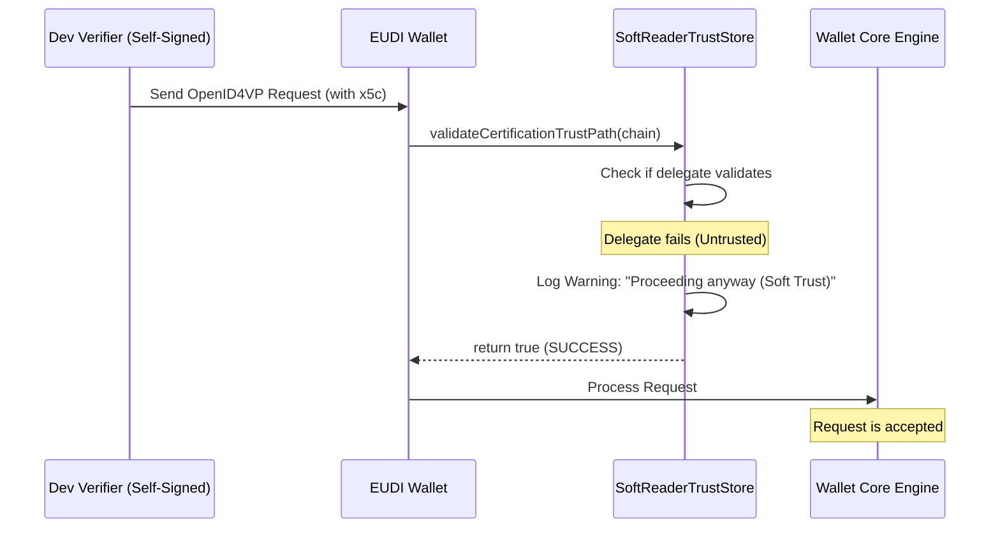

# Development Bypass for Untrusted Certificates (Testing Only)

:warning: **IMPORTANT: FOR TESTING ONLY** :warning:
The modifications described in this document are strictly for development and testing purposes. They intentionally weaken the security of the application to allow interoperability with development environments that use self-signed certificates or untrusted CAs. **These changes MUST NOT be used in a production environment.**

---

## Overview

In a production environment, the EUDI Wallet strictly validates the identity of the parties it communicates with. This includes:
1.  **TLS Server Authentication:** Ensuring the HTTPS connection to a Relying Party (RP) or Issuer is secure and trusted.
2.  **Request Signing (Reader Authentication):** Ensuring that an OpenID4VP request (received via `x5c` or `jwks`) is signed by a trusted entity.

During development, these parties often use self-signed certificates, which would normally cause the Wallet to reject the connection or the request. This document describes the "Soft Trust" bypasses implemented to facilitate testing.

---

## Modifications

### 1. Untrusted TLS Certificates (Network Layer)

The `HttpClient` has been modified to bypass standard X509 certificate validation. This allows the wallet to perform HTTP requests (e.g., fetching a request object or posting a response) to development servers using self-signed certificates.

*   **File:** `network-logic/src/main/java/eu/europa/ec/networklogic/di/NetworkModule.kt`
*   **Modification:** Configured an `X509TrustManager` that performs no checks and a `HostnameVerifier` that accepts all hostnames.

### 2. Untrusted OpenID4VP Request Signers (Reader Trust)

The `EudiWallet` core library normally validates the `x5c` chain in an OpenID4VP request against a list of trusted IACAs. We have introduced a `SoftReaderTrustStore` to bypass this check and log a warning instead.

*   **File:** `core-logic/src/main/java/eu/europa/ec/corelogic/util/SoftReaderTrustStore.kt`
*   **Modification:** Created a wrapper around `ReaderTrustStore` that always returns `true` for `validateCertificationTrustPath`.
*   **File:** `core-logic/src/main/java/eu/europa/ec/corelogic/di/LogicCoreModule.kt`
*   **Modification:** Injected the `SoftReaderTrustStore` into the `EudiWallet` instance via `withReaderTrustStore`.

### 3. Client ID Bypass (SAN Injection)

OpenID4VP requires that the `client_id` matches a Subject Alternative Name (SAN) in the certificate. To support testing with various hostnames/IPs (like `127.0.0.1` or local network IPs), the `SoftReaderTrustStore` wraps the certificates to dynamically inject these SANs.

*   **File:** `core-logic/src/main/java/eu/europa/ec/corelogic/util/SoftReaderTrustStore.kt`
*   **Modification:** Added `SoftX509Certificate` which overrides `getSubjectAlternativeNames()` to include development hostnames.

---

## How it works (Production vs. Testing)

### Production Flow (Strict Trust)
In a real-life scenario, the Verifier must present a certificate issued by a trusted Member State CA (IACA). The Wallet verifies the entire chain.

### Testing Flow (Soft Trust Bypass)
The "Soft Trust" implementation intercepts the validation results. If a chain is untrusted, it logs a warning but tells the Wallet Core that the validation was successful.

---

## Summary of Code Changes

| Feature | Modification | File Path |
| :--- | :--- | :--- |
| **TLS Bypass** | Custom `X509TrustManager` accepting all certs | `network-logic/.../di/NetworkModule.kt` |
| **Reader Trust Bypass** | `SoftReaderTrustStore` wrapper returning `true` | `core-logic/.../util/SoftReaderTrustStore.kt` |
| **Wallet Integration** | Injecting `SoftReaderTrustStore` into `EudiWallet` | `core-logic/.../di/LogicCoreModule.kt` |
| **Client ID Bypass** | Dynamic SAN injection in `SoftX509Certificate` | `core-logic/.../util/SoftReaderTrustStore.kt` |
